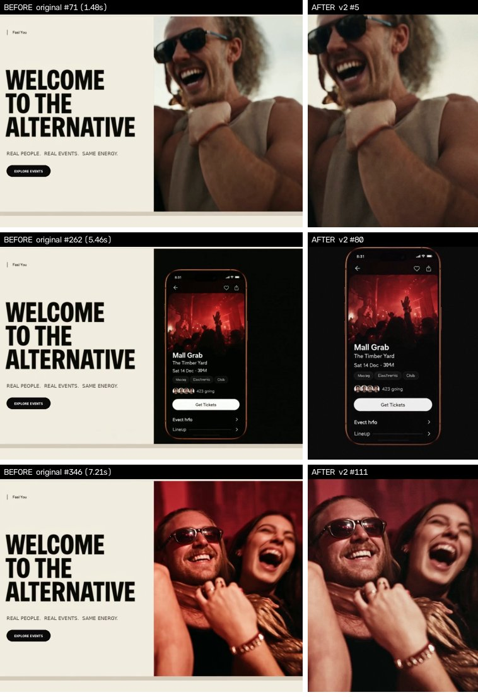

# Sheltuh promo v2: edit review

**Files**
- Source (untouched): `references/sheltuh-higgsfield-original.mp4`
- Edit: `output/sheltuh-promo-v2.mp4` (1080×1440, 3:4, 24 fps, 8.00 s, H.264 + AAC 48 kHz)
- Reproducible build: `scripts/video/build_promo_v2.py`
- Stills: `output/sheltuh-promo-v2-contact.jpg`, `output/sheltuh-promo-v2-before-after.jpg`

## Verdict

**No. v2 is not homepage-ready, and nothing more can be done in post to make it so.**

v2 is a clean edit that sets the timing for the final film. It removes every broken frame, cuts to the music, sets the grade and the brand close, and marks the slots that new footage needs to fill. The source doesn't contain the shots a premium version needs:
- There's no phone held in a hand.
- There's no real scroll or tap.
- There's no Melbourne.
- There's under 2 seconds of clean footage of people.

Every phone screen also carries AI-garbled text and the names of real artists. Those shots need regenerating (see [What to regenerate](#what-to-regenerate-in-higgsfield)).

**Do this first:** the source is a screen recording of a web page. The footage in it was shrunk to a 546 px panel and compressed to about 1.2 Mbps. If you still have the **original Higgsfield downloads** of the shots below, send them over. They're probably 1080p or larger and longer than the fragments used here:
- the curly-haired man laughing
- the two friends in daylight
- the couple laughing
- the two men in blue light

With the originals, the step-printing and most of the softness go away, and the build script can use them in the same slots.



---

## What was wrong with the original

### It's a web page, not a film

The file is a 1112×834 capture of a landing-page hero. The left half is a static layout ("WELCOME TO THE ALTERNATIVE", nav, "EXPLORE EVENTS" button). All the footage plays in a 546×716 panel on the right.

As a video, that means:
- The headline and button are frozen pixels. They can't be clicked, they don't reflow on mobile, and they blur on high-resolution screens.
- The headline contradicts the brief's end line ("FIND YOUR SCENE.") and the app's own hero ("Find your room. Find your people.").
- It claims 48 fps, but every frame is doubled. The real content is 24 fps.
- Video bitrate is 1.17 Mbps. The audio is a lossy file cut off at 16 kHz and upsampled to 96 kHz.

The type belongs in HTML, with the video in the hero's media slot. That slot is 3:4, which is why v2 is 3:4.

### Timestamped (original timeline)

| Time | Problem | Decision |
|---|---|---|
| 0.00–0.17 | Fade-in is composited wrong: a cream box bottom-left stays bright while everything else fades | Cut |
| 0.17–1.23 | Floating phone on black, frozen for over a second. Card text is gibberish ("The iber Yeard", "Te L 491/6M", "0bJ HIA TRES"). The logo morphs until 0.30 and the yellow tick smears away by 0.8 | Cut |
| 1.23–1.40 | ✅ Two friends laughing in daylight. Real-looking, but only 4 unique frames. The visor and sunglasses on the right-hand man have fused together | **Used** |
| 1.40–1.71 | ✅ Curly-haired man laughing, warm daylight. The best shot in the file. A malformed hand sits behind his shoulder | **Used** (last frame dropped: camera jump) |
| 1.71–1.88 | Out-of-focus brown blob | Cut |
| 1.88–2.94 | "Around You" list: every label is gibberish ("Aroind Yoı", "Tozby", "Destrenis", "Seccial Reqvest", "Fraille"). Text melts during the scroll (2.2–2.7) | Cut |
| 2.94–3.04 | Two men in blue light: a single still frame, no motion | **Used** as a short push-in |
| 3.06–3.19 | Melted red figure with white squiggles | Cut |
| 3.19–3.23 | Pure white flash frame | Cut |
| 3.23–3.31 | Face covered in white matte blobs (a mask error) | Cut |
| 3.33–3.44 | Crowd shot with a smeared face | Cut |
| 3.46–3.90 | Logo drawn as a stray stroke over a red crowd, then the mascot alone on black | Cut |
| 3.92–4.48 | Grid of UI cards and face tiles covered in gibberish ("MGLI GOIEN", "BET-138") | Cut |
| 4.50–4.79 | Raised hands have turned into black cubes | Cut |
| 4.81–5.08 | Event screen fades in through a blurry morph | Cut |
| 5.08–5.58 | ✅ Event detail: "Mall Grab · The Timber Yard · 423 going · Get Tickets" is readable. Smaller text is gibberish ("Sat 14 Dec · 30ᴬ4", "Mooag / Electrents", "Evect hfo") | **Used** (single clean frame) |
| 5.62–5.79 | Ghosted morph to a second hero image. The "Get Tickets" button smears | Cut |
| 5.79–6.23 | Same screen with a different image. Reads as a glitch next to the first one | Cut |
| 6.25–6.33 | Ghosted morph to the DJ card | Cut |
| 6.33–7.10 | ✅ DJ card with heart. "Crdior Club" is gibberish, there's a large empty gap in the layout, and "423 going" repeats the other event's number | **Used** (single clean frame) |
| 7.12–7.33 | ✅ Couple laughing under red light. Strong, but skin reads as solid red | **Used** (graded) |
| 7.35–7.58 | Laughing man frozen for 3 frames, then the background swaps and a stick-like artefact grows out of his hair | Cut |
| 7.60–7.94 | Hand close-ups ×3 with extra and malformed fingers | Cut |
| 7.96–8.17 | QR ticket: gibberish ("Ocmad Iafemdiad", "Aeet Tickelog") and the QR code dominates the frame | Cut |
| 8.17–8.46 | Fade to black with the same cream-box compositing bug. The music doesn't fade; it cuts off at full level | Cut |

**Pacing:** holds of more than a second on frozen frames, then a 1.9 s run of 1–6-frame flashes. There's no story arc: product, logo, product, crowd, product, ticket.

**Legal:** the screens name real artists (Mall Grab, Special Request, DJ Gigola) and a real Melbourne venue (The Timber Yard). On Sheltuh's homepage that implies they're on the platform. That's a misleading-conduct risk under Australian Consumer Law (ss 18 and 29). Use invented names, or get written permission, before anything goes public. v2 still shows these names, so it is **internal only**.

---

## Exactly what changed

Cut to the music: 135.3 BPM, beat = 0.4436 s = 10.65 frames. Every cut lands within ±1 frame of a beat. No frame interpolation, no AI upscaling, no generated or replaced UI, and nothing overlaid on the phone.

| v2 time | Frames | Slot | Source (original time) | Treatment |
|---|---|---|---|---|
| 0.00–0.46 | 0–10 | Hook | 1.40–1.63 (6 frames) | 3:4 crop from the web panel; each frame shown twice (12 fps "slow motion"); push 100→102.5% toward the face; daylight grade |
| 0.46–0.88 | 11–20 | Hook | 1.23–1.38 (4 frames) | Same treatment; 2–3 frame cadence |
| 0.88–2.21 | 21–52 | App: save | 6.88 (one frame) | Phone moved to the centre (+83 px across, −30 px up), green tint taken out of the black, held still; push 96% → ~98% |
| 2.21–4.42 | 53–105 | App: event + Who's Going | 5.46 (one frame) | Same position and push continues to 101%. The bezel stays put across the cut, so the screen change reads as tapping into the event |
| 4.42–4.88 | 106–116 | Payoff | 7.12–7.31 (5 frames) | Shown twice each, push 100→102%; night grade (saturation 80%, red pulled back) |
| 4.88–5.33 | 117–127 | Payoff | 2.94 (one frame) | Push 100→103%; club grade (mids lifted, saturation 82%) |
| 5.33–8.00 | 128–191 | Brand close | New | Off-white #f5f4f0 with #0b0b0e type, both from the app's colour tokens. **SHELTUH** in Bebas Neue (the app's heading font) from the cut; **FIND YOUR SCENE.** eases in (fade plus a 6 px rise) at 5.75 s, one beat later |

**Grade:** small by design.
- Blacks are neutral, lifted to about 6/255 rather than crushed.
- Highlights roll off softly to off-white (about 240) instead of clipping.
- Warmth is added in the highlights only.
- Saturation is 80–93% depending on the shot.
- Mid-tone contrast gets a gentle S-curve on daylight shots only.

**Upscale:** 2.02× Lanczos with a light unsharp mask (0.3). Stronger sharpening brought out the source's compression blocks.

**Grain:** monochrome and 2 px, mostly in the mid-tones. It changes every frame, so held frames don't look frozen.

**Audio:** original music bed only; nothing synthetic added.
- Starts on the first kick (0.114 s).
- 25 Hz high-pass.
- At the brand cut, a low-pass sweeps from 18 kHz down to 900 Hz over one beat, like walking out of the room. It then fades out under the type.
- Loudness is about −14 LUFS (measured −13.7), true peak −2.8 dBFS.
- Checked: 2 ms offset from the planned start, no clicks, clean decode.

**Encode:** H.264 High, CRF 16 tuned for grain, BT.709 tags, faststart. 13 MB at about 13 Mbps, a master-quality file.

---

## Still imperfect (v2 timestamps)

| Time | Issue | Fixable in post? |
|---|---|---|
| 0.00–0.88 | Hook plays at 12 fps because only 6 and 4 clean frames exist. The push hides it, but it reads as a stylised step | Only with the original Higgsfield clips |
| 0.00–0.88, 4.42–5.33 | Soft: a 2× upscale of a 534 px, 1.2 Mbps source | Only with the original Higgsfield clips |
| 0.10–0.40 | Malformed blurred hand at the left edge behind the curly-haired man | No (cropping further makes it softer) |
| 0.46–0.88 | Visor and sunglasses fused together on the right-hand man | No |
| 0.88–4.42 | **Floating phone on black: no hand, no place, nothing interacts.** The brief explicitly ruled this out | Regenerate |
| 0.88–4.42 | Gibberish small text: "Crdior Club", "Nooag / Eiachrerits / Cltib", "Sat 14 Dec · 30ᴬ4", "Evect hfo" | Regenerate (never fix text by painting over it) |
| 0.88–4.42 | Real artist and venue names; both events show "423 going" | Regenerate |
| 0.88–4.42 | 3.5 s of static screens. No Discover scroll, and the heart is never tapped | Regenerate |
| 4.88–5.33 | A single still with a push, not live footage | Regenerate |
| Whole piece | No Melbourne, no daylight city, no arrivals. Only club and party imagery, though Sheltuh also covers art, workshops and pop-ups | Regenerate |
| Audio | Lossy, cut off at 16 kHz, and a loop with no natural ending. The licence for the music is unknown | Get the full lossless track and confirm its licence |

---

## What to regenerate in Higgsfield

**Rule 1: never generate UI in Higgsfield.** Video models turn text into gibberish, and every phone screen in the source failed that way.

Generate the **phone as a green-screen plate** held in a real hand in a real place. Then put a **screen recording of the actual Sheltuh app** onto it with a four-corner track (Resolve Fusion's planar tracker, After Effects with Mocha, or similar). The app is already built (`components/EventFeed.tsx`, `EventDetailsView.tsx`, `TicketSelector.tsx`). Record it at phone size (390×844 at 3×) using sample data with **invented artist and venue names**.

**Rule 2: settings.**
- Portrait (3:4 if offered, otherwise 9:16 cropped to 3:4), 1080p or higher, 24 fps.
- Generate 5 s and keep the cleanest 1–2 s.
- Download the original file, not a screen capture.
- Use the same three or four people in every shot. Generate reference stills first, then use image-to-video (or a consistent-character feature if your plan has one), so the hook and payoff show the same friend group.

**Rule 3: add this to every prompt.**
> No text, no letters, no signage, no logos, no graffiti lettering, no subtitles. Natural hands with five fingers, hands relaxed or out of frame. Realistic skin texture, no plastic skin. No morphing, no warping, no sudden scene changes.

### R1: Hook (0:00–0:01.5). Replaces v2 0.00–0.88 and original 1.23–1.71
Text-to-video, or image-to-video from a still you approve. Camera: slow backward tracking shot, light handheld.
> Three friends in their mid-twenties walk toward camera down a narrow Melbourne bluestone laneway at golden hour, one laughing and turning back to the others mid-sentence. Low warm sun flaring from behind them, cream and off-white clothing with one black jacket, candid and unposed. Shot on 35mm film, 50mm lens, shallow depth of field, slow backward tracking shot with gentle handheld movement. Editorial fashion campaign look, natural skin tones, warm highlights, soft film grain.

Keep: the 1–1.5 s where everyone's face and gait stay stable. Reject: any take with lettering on the walls.

### R2: Phone arrives, Discover scroll (0:01.5–0:03.5). Replaces the floating phones at original 0.17–1.23 and 1.88–2.94
Plate for screen replacement. Camera: locked off, with slight handheld drift.
> Over-the-shoulder close-up of a young woman seated at the window of a Melbourne tram at golden hour, lifting an iPhone into frame in her right hand and slowly scrolling with her thumb. The phone screen is a flat, evenly lit solid chroma-green screen with no content. Warm sunlight moves across her hand and sleeve; the street blurs past the window behind. 35mm film look, 85mm lens, shallow depth of field.

In post: track the screen and insert a recording of the Discover feed scrolling past two or three event cards with bright, varied artwork.

### R3: Open the event, Who's Going (0:03.5–0:05.5). Replaces original 4.81–7.10
Plate. Camera: slow push-in.
> Tight close-up of a hand holding an iPhone above a café table in Fitzroy, late-afternoon window light, the phone screen a flat solid chroma-green screen. The camera pushes in slowly toward the phone. A coffee cup and canvas tote sit softly out of focus; warm neutral palette, off-white linen, natural skin. 35mm film look, 50mm macro lens, shallow depth of field, steady relaxed grip.

In post: insert the event-detail screen, showing the artwork, venue and date, and the **Who's Going** row with friends' faces. Let the page settle as the camera arrives.

### R4: Save or Going tap (0:05.5–0:07). Replaces original 6.33–7.10 (the heart is never tapped) and 7.96–8.17 (QR)
Plate. Camera: locked off.
> Macro close-up of a thumb tapping once on the lower third of an iPhone screen held in a hand at night outside a venue, the screen a flat solid chroma-green screen. Red and deep-blue neon bokeh behind, warm skin tones. One deliberate tap, then the thumb lifts away. 100mm macro lens, shallow depth of field, locked-off camera.

In post: insert the real "Going ✓" or ticket-confirmed state and time the tap to a beat. If a ticket is shown, keep the QR code small and let it sit on screen only briefly.

### R5: Payoff, arrival (0:07–0:08). Replaces original 7.35–7.94
Camera: handheld, slight push-in.
> Night outside a small brick warehouse venue in Collingwood, Melbourne. Four friends greet each other with hugs and laughter under a warm tungsten doorway light, red neon glow spilling across the brick. Stylish streetwear in black and off-white, candid and energetic, nobody looking at the camera. 35mm film look, 35mm lens, medium shot, handheld with a slow push-in.

### R6: Payoff, inside the room (0:08–0:09). Replaces original 2.96–4.79 and the still at v2 4.88–5.33
Camera: handheld within the crowd, gentle sway.
> Inside a packed small Melbourne warehouse gig at night, filmed from within the crowd toward a low stage: silhouettes dancing through haze, a woman in the foreground turns and laughs to her friend, red and deep-blue stage light cutting through the smoke. 35mm film look, 28mm lens, handheld with gentle sway, slight motion blur, faces natural, hands kept low.

### R7 (recommended): Culture beyond clubs. Swap for R1, or use as a second hook shot
Camera: slow sideways dolly.
> Golden-hour gallery opening in a sunlit Melbourne warehouse: stylish people with drinks talking in front of large colourful abstract paintings, sunlight through tall factory windows onto off-white walls, one person laughing mid-conversation. 35mm film look, 35mm lens, slow lateral dolly, warm natural light.

### Don't regenerate; build these in post
- **Brand close:** typography is set in post (done in v2) and never generated.
- **Logo or mascot animation:** only use this if the mark is final, and animate the vector, not a generation.
- **Any UI, ticket, QR code or event text:** always a real app recording, composited onto a plate.

---

## Rebuilding and conforming

```bash
python3 scripts/video/build_promo_v2.py            # needs ffmpeg, numpy, opencv-python-headless, pillow
python3 scripts/video/build_promo_v2.py --grain 0.006 --crf 20   # lighter grain for web
```

Slots are defined in beats in `EDIT` (hook 0–2, app 2–10, payoff 10–12, brand 12–18). New shots should be cut to the same beat lengths, so the music, the tagline timing and the low-pass all still land.

**Web delivery:** the 13 MB master is too heavy for a hero video. Export a muted, looping, `playsinline` version at roughly 2–4 MB (H.264 CRF 23–26 or AV1) with a poster frame. Render the headline and CTA in HTML next to it, not in the video. One more decision to make: the card uses **SHELTUH** as briefed, but the brand wordmark is **Sheltüh** (the favicon is the ü). The umlaut version is a one-word change in the script.
